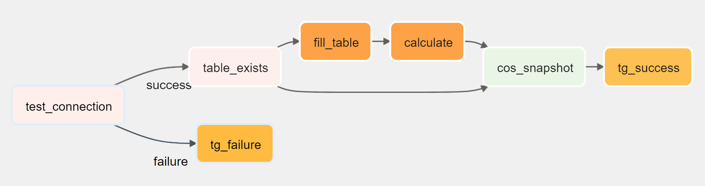

# Airflow setup
I tried every possible way, the most convenient and, most importantly, working one is based on WSL.
1. Install WSL (skip if you are on Linux).
2. Run these commands to install all necessaries.

```bash
apt update && apt upgrade;
apt install default-jdk;
apt install pip;
pip install apache-airflow;
pip install apache-airflow-providers-apache-spark-operators;
pip install apache-airflow[spark];
pip install apache-airflow[jdbc];
pip install apache-airflow[telegram];
```

3. Check your env
```bash
env | sort | grep HOME
```
Set `SPARK_HOME` if it's not already set.
```bash
export SPARK_HOME="/mnt/d/software/Spark/spark-3.1.3-bin-hadoop3.2"
```
And add it to path.
```bash
export PATH=$SPARK_HOME/bin:$PATH; source ~/.bashrc
```
By the way you can't use your java installed in Windows and setting it in path like Spark above wont work.


4. Tweak airflow config (optional).

```bash
nano ~/airflow/airflow.cfg
```
ctrl+w for search
> your dag folder

dags_folder = /mnt/c/Users/user/Desktop/Scala_training/airflow
> refresh your dags every 5 seconds

dag_dir_list_interval = 5

Set "local" instead of "yarn" in `spark_default` connection in airflow GUI.

5. Launch Airflow
```bash
airflow db init; airflow standalone
```

# DAG graph


# Run DAG
Set your credentials in aiflow connections.  
Check your dag is in Airflow GUI and run it.

# Plans
1. Debug and test jdbc hooks (use jinja templating to pass table names)
2. Create telegram bot to send messages from
3. Extend/rework my app's cli interface so it is possible to fill table and do calculations independently
4. Try to implement some kind of pagination (read and write iterators?) when calculating annual sales instead of loading whole table into ram

# Questions
When I tried to install Ubuntu and Mint virtual machines they worked awful, constant lags and crushes
for no reason. Is there any protection software involved, which is trying to put down my VM?

