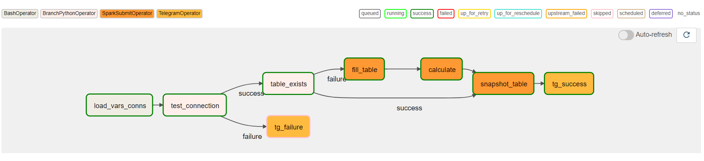

# Airflow setup
I tried every possible way, the most convenient and, most importantly, working one is based on WSL.
1. Install WSL (skip if you are on Linux).
2. Run these commands to install all necessaries.
    ```bash
    apt update && apt upgrade;
    apt install default-jdk;
    apt install pip;
    pip install apache-airflow;
    pip install apache-airflow[spark];
    pip install apache-airflow[jdbc];
    pip install apache-airflow[telegram];
    ```

3. Check your env
    ```bash
    env | sort | grep HOME
    ```
    Set `SPARK_HOME` if it's not already set.
    ```bash
    export SPARK_HOME="/mnt/d/software/Spark/spark-3.1.3-bin-hadoop3.2"
    ```
    And add it to path.
    ```bash
    export PATH=$SPARK_HOME/bin:$PATH; source ~/.bashrc
    ```
    By the way you can't use your java installed in Windows and setting it in path like Spark above wont work.


4. Tweak airflow config (optional).
    ```bash
    nano ~/airflow/airflow.cfg
    ```
    ctrl+w for search
    > your dag folder

    dags_folder = /mnt/c/Users/user/Desktop/Scala_training/airflow
    > refresh your dags every 5 seconds

    dag_dir_list_interval = 5

    Set "local" instead of "yarn" in `spark_default` connection in airflow GUI.

5. Initialize airflow config db nad add variables and connections.
    It's better to turn off any antimalware software from this step on.
    Modify configs in ./json folder then run the following to load them in airflow.
    ```bash
    airflow db init;
    airflow variables import ./json/variables.json;
    airflow connections import ./json/connections.json
    ```

6. Launch Airflow
    ```bash
    airflow standalone
    ```

# DAG graph


# Run DAG
Set your credentials in aiflow connections.  
Check your dag is in Airflow GUI and run it.

# Problems
Spark just decided to die, spark-submit doesn't work at all anymore hence SparkOperator is always down too.
Logs are in ./logs/spark_death.log

# Plans
1. Extend/rework my app's cli interface so it is possible to fill table and do calculations independently
2. Create telegram bot to send messages from
3. Try to implement some kind of pagination (read and write iterators?) when calculating annual sales instead of loading whole table into ram

# Questions
1. I read something like I shouldn't write any code outside of DAG's operators because it slows down airflow when
   it parses DAGs. Should I move my constants initialization in the beggining of my DAG to operators?

2. When I tried to install Ubuntu and Mint virtual machines they worked awful, constant lags and crushes
   for no reason. Is there any protection software involved, which is trying to put down my VM?

